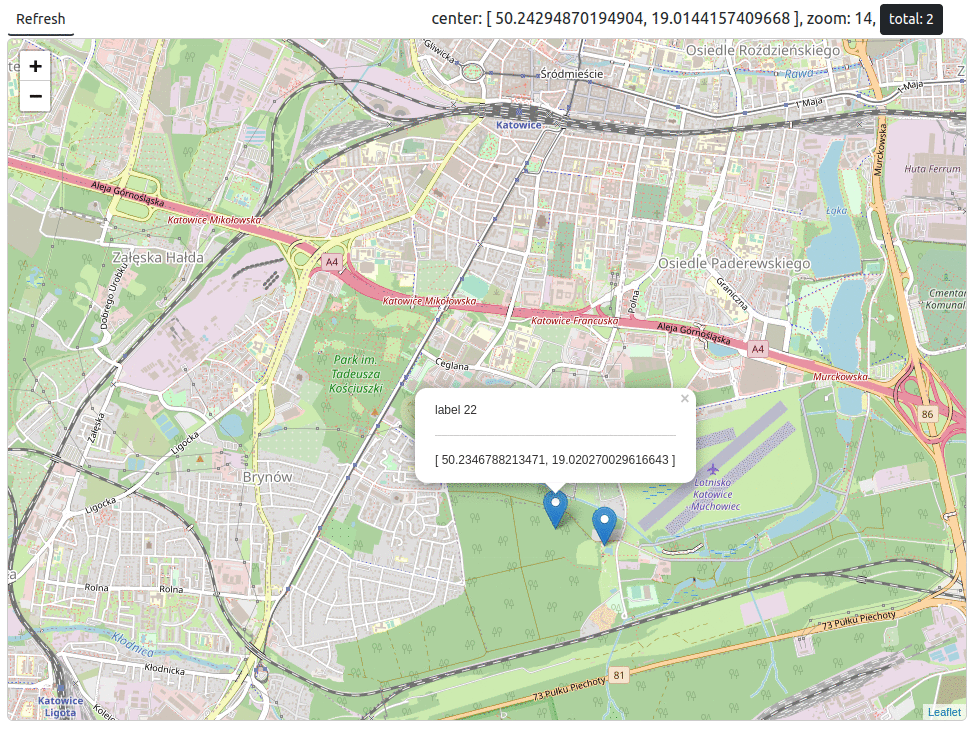

# Aboutheight:32px

Project for kubernetes  training purposes. 

Scope:
- [webapp](https://github.com/illegal-dump/webapp), simple GUI written in Vue , Node  and mock server 
- [api-gateway](https://github.com/illegal-dump/api-gateway), set of ymls for NGINX Kubernetes Gateway deployment
- [coordinates](https://github.com/illegal-dump/coordinates), app written in Kotlin , Quarkus  and PostgreSQL   
- ...
- [k8](https://github.com/illegal-dump/.github/tree/main/k8) - complete set of ymls for illegal-dump project (all above projects)


As a part of training deployment will take place locally (minikube) and on AWS.

<br/><br/><br/>

# Architecture


<br/><br/><br/>

# Kubernetes

## 1. Create cluster

```
minikube start --memory 8192 --cpus 2
```

## 2. Add entry to /etc/hosts

```
echo "$(minikube ip) minikube.local" | sudo tee -a /etc/hosts
```

test by `ping minikube.local`:
```
PING minikube.local (192.168.49.2) 56(84) bytes of data.
64 bytes from minikube.local (192.168.49.2): icmp_seq=1 ttl=64 time=0.133 ms
64 bytes from minikube.local (192.168.49.2): icmp_seq=2 ttl=64 time=0.117 ms
^C
--- minikube.local ping statistics ---
2 packets transmitted, 2 received, 0% packet loss, time 1005ms
rtt min/avg/max/mdev = 0.117/0.125/0.133/0.008 ms
```

## 3. Install NGINX Kubernetes Gateway

See [api-gateway](https://github.com/illegal-dump/api-gateway) instruction.


## 4. Install PostgreSQL via helm

See [PostgreSQL](https://github.com/illegal-dump/coordinates) instruction via helm

## 5. Apply yml-s from k8 folder

```
kubectl apply -f k8/
```

and go to [http://minikube.local:30080](http://minikube.local:30080)



<br/><br/><br/>


---

### kubectl Cheat Sheet

[https://kubernetes.io/docs/reference/kubectl/cheatsheet/](https://kubernetes.io/docs/reference/kubectl/cheatsheet/)


---

### Attribution
icons: [https://www.vecteezy.com/free-vector/dump](https://www.vecteezy.com/free-vector/dump)

map: [https://www.openstreetmap.org/](https://www.openstreetmap.org/) and [https://leafletjs.com](https://leafletjs.com)

